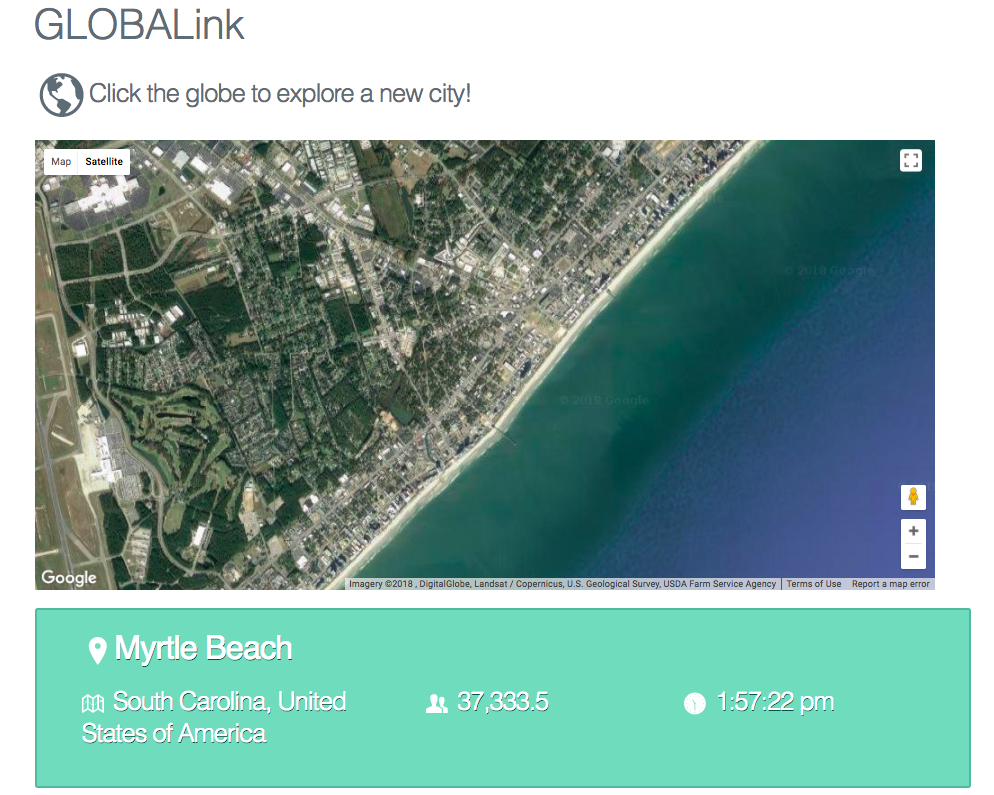
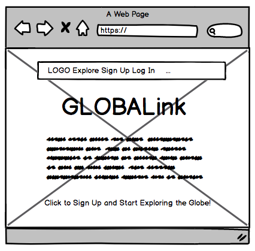
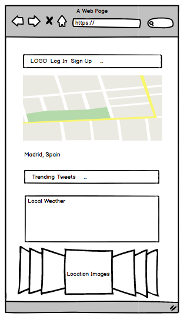
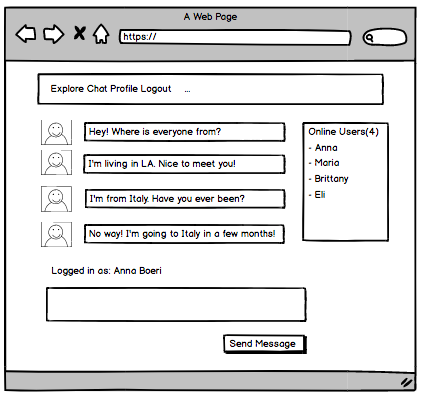
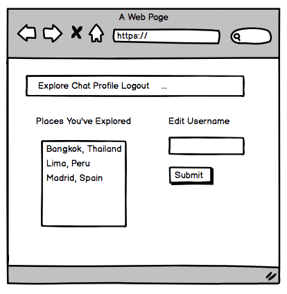

# GLOBALink

###### Explore the world one random city at a time. 
---

This app allows users to learn about cities around the world by generating a random world city and displaying relevant information about that city, including: the city's location, population, local time, current weather, popular places nearby, current twitter trends, as well as information about the country that the city is located in. Users can also chat in real time with other users from around the globe that are also logged in to the app.

##### Check out the app [here](https://project-4-globalink.herokuapp.com/)!

### Technologies Used
- HTML
- CSS
- JavaScript
- NodeJS
- Express
- Mongoose
- React
- Socket.io
- JSON Web Token
- Milligram CSS

### APIs Used
- Google Maps via the google-maps-react library
- Google Places API
- Google Maps Time Zone API
- Twitter API via twitter client library
- OpenWeatherMap API
- RESTCountries API

### Future Work
- Add flash messages on log in and sign up
- Show list of places users have "explored" on their profile
- Add user's geolocation and display users' location in chat
- Allow users to upload avatar images that display in chat

### Wireframes

